# 前言

完全免费的git网站搭建, 参考 https://blog.csdn.net/yaorongke/article/details/119089190

实现的目标: 本地写markdown, 推送github即可以看 github.io 域名查看网页。

实现的工具

- `nodejs`           hexo生成网站
- `codeup.aliyun.com`    保存自己的博客代码
- `github.com`   静态页面展示 
- `vscode`   开发工具

<!--more-->

# 生成静态页面

参考  https://blog.csdn.net/yaorongke/article/details/119089190 确保访问OK

slcnx.github.io 仓库名

准备index.html

```
<!DOCTYPE html>
<html lang="en">
<head>
  <meta charset="UTF-8">
  <meta http-equiv="X-UA-Compatible" content="IE=edge">
  <meta name="viewport" content="width=device-width, initial-scale=1.0">
  <title>主页</title>
</head>
<body>
  hello world
</body>
</html>
```

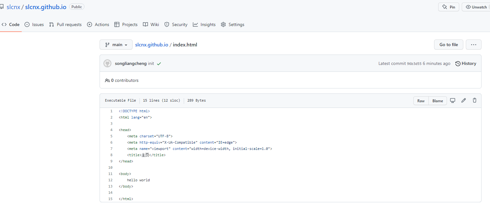


# docker推送github

新建临时目录，vscode打开, 准备以下文件

id_rsa_2048 **需要linux生成或xshell生成，不可以自己生成**

id_rsa_2048的公钥加入到以上仓库中


Dockerfile

```
FROM node:latest


WORKDIR /data/git 

ADD id_rsa_2048 /root/.ssh/
RUN  chmod 600 /root/.ssh/id_rsa_2048 

ADD . ./

# 生成网页
#RUN npm run build 


# 上传到GIT

RUN install -dv /data/page/ && cp -a index.html /data/page/


WORKDIR /data/page/
ENV GIT_SSH_COMMAND='ssh -i /root/.ssh/id_rsa_2048  -o IdentitiesOnly=yes -o UserKnownHostsFile=/dev/null -o StrictHostKeyChecking=no'
RUN git config --global init.defaultBranch main && git config --global user.email '2192383945@qq.com' && git config --global user.name 'songliangcheng'  && \
    git config --global pull.rebase true && \
    git init && \
    git remote add origin git@github.com:slcnx/slcnx.github.io.git && git add -A && git commit -m init && git push --force origin main 
```

index.html

```
<!DOCTYPE html>
<html lang="en">

<head>
    <meta charset="UTF-8">
    <meta http-equiv="X-UA-Compatible" content="IE=edge">
    <meta name="viewport" content="width=device-width, initial-scale=1.0">
    <title>主页</title>
</head>

<body>
    cat
</body>

</html>
```

```bash
D:\vscode_projects\myblog>docker build -t test .
```


# 本地生成hexo仓库

## 初始化

```bash
npm install hexo-cli -g

# 当前目录为项目根
hexo init test1blog
cd test1blog

# 内容
$ ls
_config.landscape.yml  node_modules/  package-lock.json  source/
_config.yml            package.json   scaffolds/         themes/
```

## 启动

```
hexo server
```

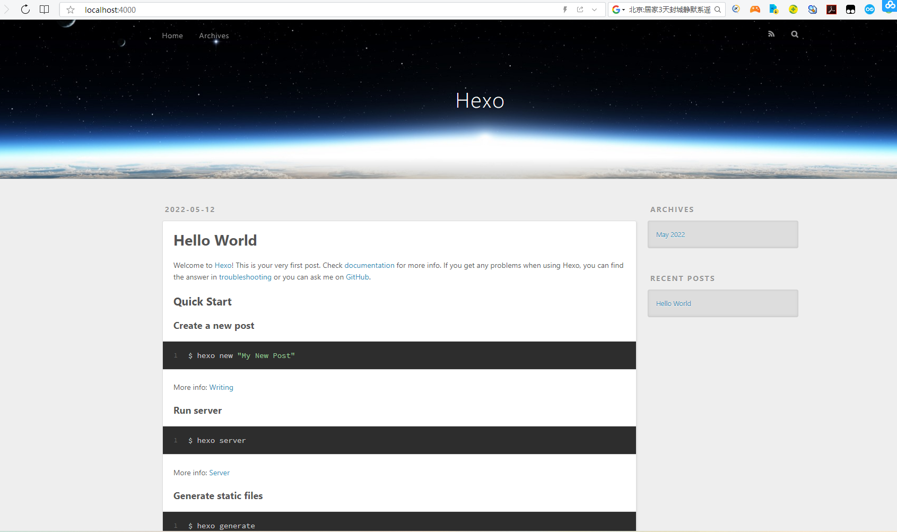


## 发布到github

在以上目录 `test1blog` 中生成以下文件

1. `.dockerignore`

   ```
   node_modules/
   ```

2. `Dockerfile`

   ```dockerfile
   FROM node:latest
   
   
   WORKDIR /data/git 
   
   ADD id_rsa_2048 /root/.ssh/
   RUN  chmod 600 /root/.ssh/id_rsa_2048 
   
   ADD . ./
   
   # 生成网页
   RUN npm install && npm run build 
   
   # 上传到GIT
   RUN install -dv /data/page/ && cp -a public /data/page/
   
   ARG GITHUB
   ARG GUSER 
   ARG EMAIL 
   WORKDIR /data/page/public/
   ENV GIT_SSH_COMMAND='ssh -i /root/.ssh/id_rsa_2048  -o IdentitiesOnly=yes -o UserKnownHostsFile=/dev/null -o StrictHostKeyChecking=no'
   RUN git config --global init.defaultBranch main && git config --global user.email $EMAIL  && git config --global user.name $GUSER  && \
       git config --global pull.rebase true && \
       git init && \
       git remote add origin $GITHUB && git add -A && git commit -m init && git push --force origin main 
   ```

3. `id_rsa_2048` 以上与github互通的密钥

4. 发布

   ```
   docker build --build-arg GITHUB=git@github.com:slcnx/slcnx.github.io.git --build-arg EMAIL='2192383945@qq.com' --build-arg GUSER='songliangcheng' ./
   ```

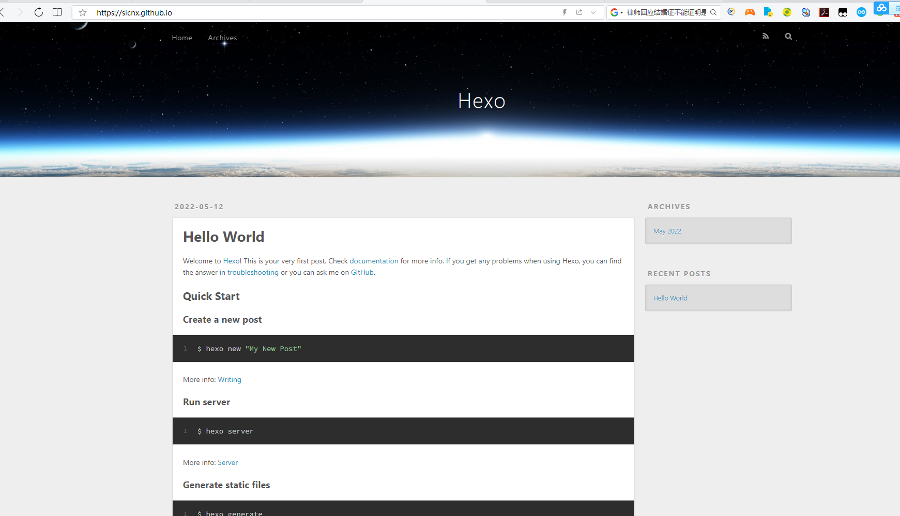

# codeup一键发布

## 添加codeup仓库

将当前仓库加入到自己的codeup中

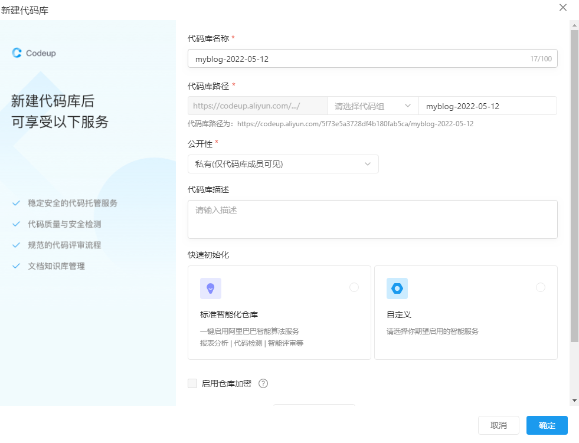

复制https地址 https://codeup.aliyun.com/5f73e5a3728df4b180fab5ca/myblog-2022-05-12.git


## 初始化代码

将上面test1blog中，初始化，添加代码

```bash
git config --global init.defaultBranch main
git init
git remote add origin https://codeup.aliyun.com/5f73e5a3728df4b180fab5ca/myblog-2022-05-12.git
```

添加文件 `.gitignore`

```bash
# Logs
logs
*.log
npm-debug.log*
yarn-debug.log*
yarn-error.log*
lerna-debug.log*
.pnpm-debug.log*

# Diagnostic reports (https://nodejs.org/api/report.html)
report.[0-9]*.[0-9]*.[0-9]*.[0-9]*.json

# Runtime data
pids
*.pid
*.seed
*.pid.lock

# Directory for instrumented libs generated by jscoverage/JSCover
lib-cov

# Coverage directory used by tools like istanbul
coverage
*.lcov

# nyc test coverage
.nyc_output

# Grunt intermediate storage (https://gruntjs.com/creating-plugins#storing-task-files)
.grunt

# Bower dependency directory (https://bower.io/)
bower_components

# node-waf configuration
.lock-wscript

# Compiled binary addons (https://nodejs.org/api/addons.html)
build/Release

# Dependency directories
node_modules/
jspm_packages/

# Snowpack dependency directory (https://snowpack.dev/)
web_modules/

# TypeScript cache
*.tsbuildinfo

# Optional npm cache directory
.npm

# Optional eslint cache
.eslintcache

# Optional stylelint cache
.stylelintcache

# Microbundle cache
.rpt2_cache/
.rts2_cache_cjs/
.rts2_cache_es/
.rts2_cache_umd/

# Optional REPL history
.node_repl_history

# Output of 'npm pack'
*.tgz

# Yarn Integrity file
.yarn-integrity

# dotenv environment variable files
.env
.env.development.local
.env.test.local
.env.production.local
.env.local

# parcel-bundler cache (https://parceljs.org/)
.cache
.parcel-cache

# Next.js build output
.next
out

# Nuxt.js build / generate output
.nuxt
dist

# Gatsby files
.cache/
# Comment in the public line in if your project uses Gatsby and not Next.js
# https://nextjs.org/blog/next-9-1#public-directory-support
# public

# vuepress build output
.vuepress/dist

# vuepress v2.x temp and cache directory
.temp
.cache

# Docusaurus cache and generated files
.docusaurus

# Serverless directories
.serverless/

# FuseBox cache
.fusebox/

# DynamoDB Local files
.dynamodb/

# TernJS port file
.tern-port

# Stores VSCode versions used for testing VSCode extensions
.vscode-test

# yarn v2
.yarn/cache
.yarn/unplugged
.yarn/build-state.yml
.yarn/install-state.gz
.pnp.*


# 静态文件
public 
```

## 推送aliyun

```bash
# 状态
$ git status
hint: core.useBuiltinFSMonitor will be deprecated soon; use core.fsmonitor instead
hint: Disable this message with "git config advice.useCoreFSMonitorConfig false"
On branch main

No commits yet

Untracked files:
  (use "git add <file>..." to include in what will be committed)
        .dockerignore
        .github/
        .gitignore
        .npmignore
        Dockerfile
        _config.landscape.yml
        _config.yml
        db.json
        id_rsa_2048
        package-lock.json
        package.json
        scaffolds/
        source/
        themes/
        
# 生成标志
$ echo '1111' >> source/_posts/hello-world.md

# 推送
git add . 
git commit -m init

$ git push origin main
Enumerating objects: 122, done.
Counting objects: 100% (122/122), done.
Delta compression using up to 8 threads
Compressing objects: 100% (110/110), done.
Writing objects: 100% (122/122), 580.00 KiB | 7.34 MiB/s, done.
Total 122 (delta 0), reused 0 (delta 0), pack-reused 0
To https://codeup.aliyun.com/5f73e5a3728df4b180fab5ca/myblog-2022-05-12.git
 * [new branch]      main -> main

```

## aliyun验证

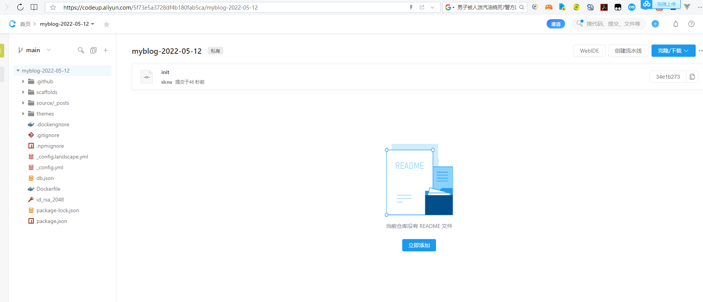

## 添加流水线

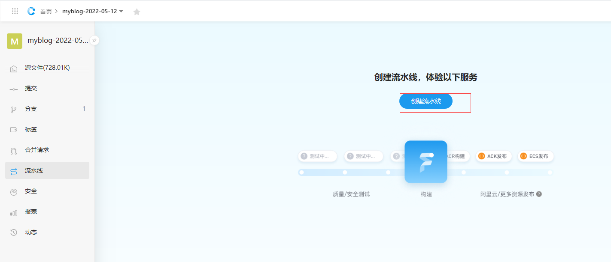

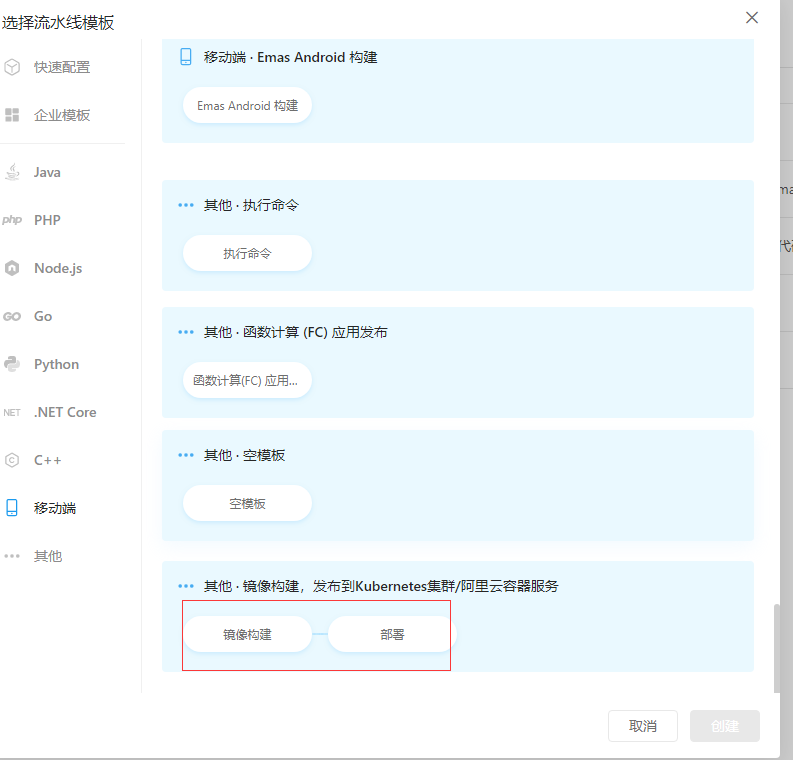

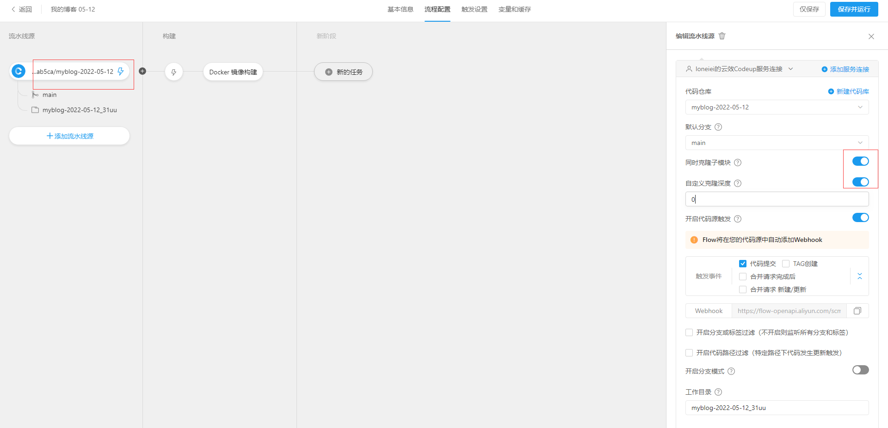


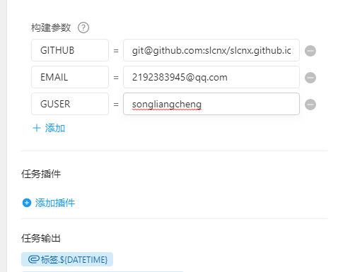

删除kubernetes发布

保存并运行


## 查看运行日志

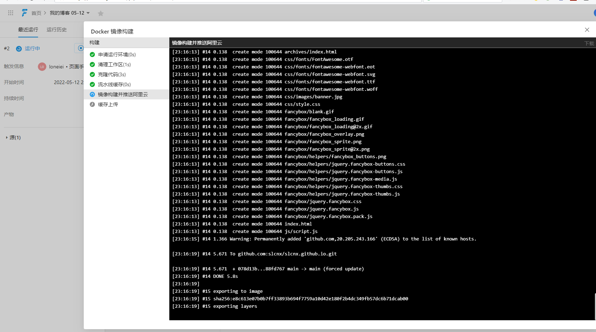

## 查看github进度

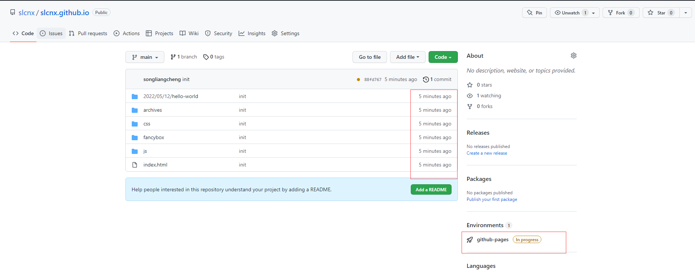

## 查看页面

当进度为


# 开发方式

## 准备vscode

在vscode中加载 codeup的仓库

安装插件 typora  **安装后需要重启vscode**

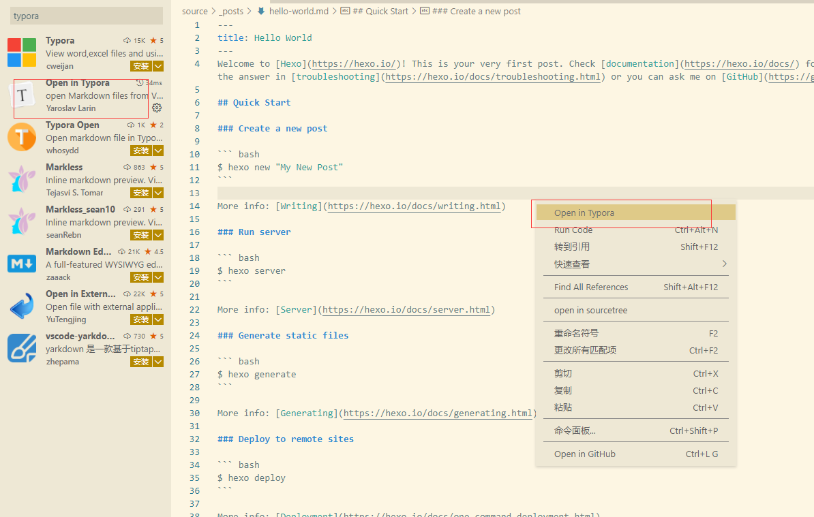

## 本地开发

```bash
# clone 代码

# 安装依赖
npm install

# 运行服务
npx hexo server
```

> `npx command` 相当于加载了`$(npm bin)` 目录到环境变量, 后面的命令可以执行

通过本地调试出合理的界面, 推送aliyun, 就可以一键发布

## 本地添加文章

脚本 `addarticle.sh`

```
echo -ne "Enter a \033[1;31mtitle\033[0m for your blog: "; read title
[ $? -ne 0 ] && echo 'exit' && sleep 3 && exit 1
[ -z "$title" ] && echo title must be exists. && sleep 3 && exit 1
npx hexo new "$title"

start $(readlink -f .)/source/_posts
```

生成文章, 运行脚本

```
---
title: 第1个文章
date: 2022-05-12 23:27:58
---
```

## 个性化页面展示 

https://blog.csdn.net/yaorongke/article/details/119089190

- `hexo站点配置`
- `fluid`主题配置
- `阅读量`
- `评论功能`

例如修改标题 `_config.yml`

```yaml
title: "5-12 23:30"
# ...

post_asset_folder: true
```

```bash
# 处理typora相对路径
npm install hexo-typora-asset --registry https://registry.npmjs.org --save
```

typora中的配置

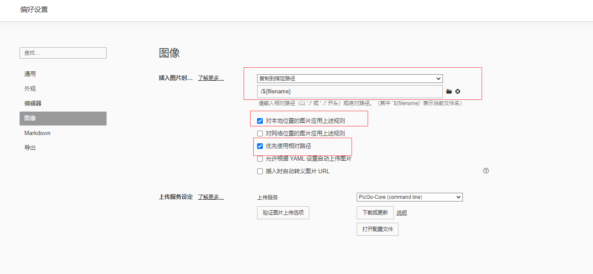

重启 `npx hexo server`

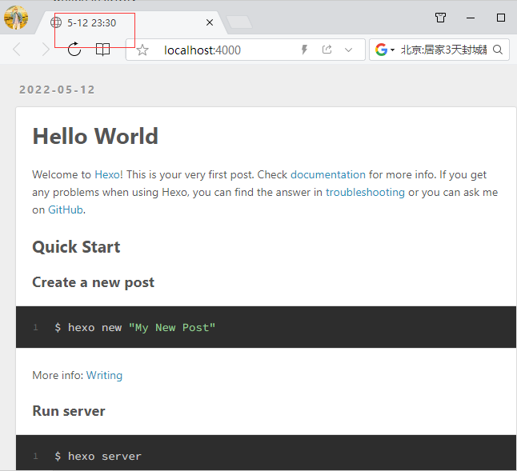


## 文章默认页面(可选)

https://hexo.io/docs/writing#Scaffolds

当我们写大量的文章,发现主页不应该显示所有内容,需要readmore, readmore之前有1小段简介

如下, 上面的nginx文章会`显示标题,简介,readmore`, 而下面的hello world就显示所有, 这两者区别在于

后者,默认

```
---
title: 第1个文章
date: 2022-05-12 23:27:58
---
```

前者

```
---
title: 第1个文章
date: 2022-05-12 23:27:58
tags:
- hello
categories:
- nginx
---


# 背景

这篇讲解如何编译安装nginx, 优化nginx

<!--more-->
```

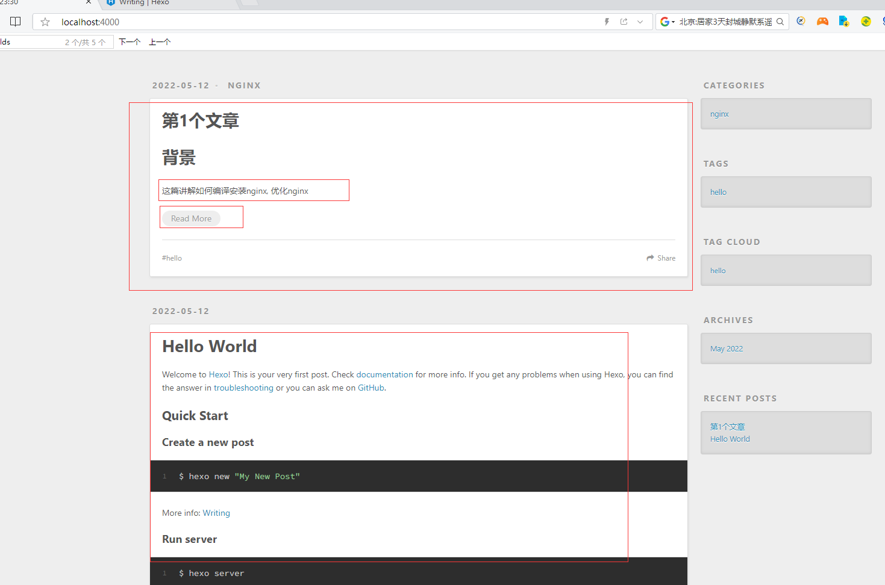

要实现每个文章创建均生成nginx这样的模板, 编辑 `scaffolds/post.md`

```
---
title: {{ title }}
date: {{ date }}
tags:
- 
categories:
- 
---

# 背景

<!--more-->
```

现在运行脚本 `addarticle.sh` 添加**第2个文章**

网页已经达到效果

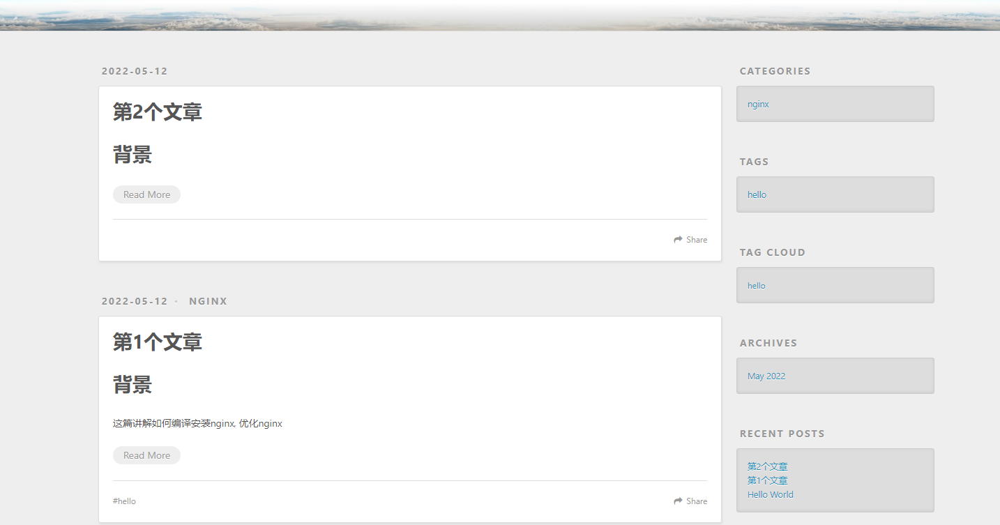

## 准备一个主题 fluid

> 使用此主题后, 不需要前面的文章默认页面, 每个页面不需要加`<!--more-->` 主题会自动抽取前多少个字符,作为描述的.

Fluid主题 https://blog.csdn.net/yaorongke/article/details/119089190

```
$ git submodule add https://github.com/fluid-dev/hexo-theme-fluid.git themes/fluid
```

编辑 `_config.yml`

```
# Extensions
## Plugins: https://hexo.io/plugins/
## Themes: https://hexo.io/themes/
theme: fluid
```

重启 `npx hexo server`

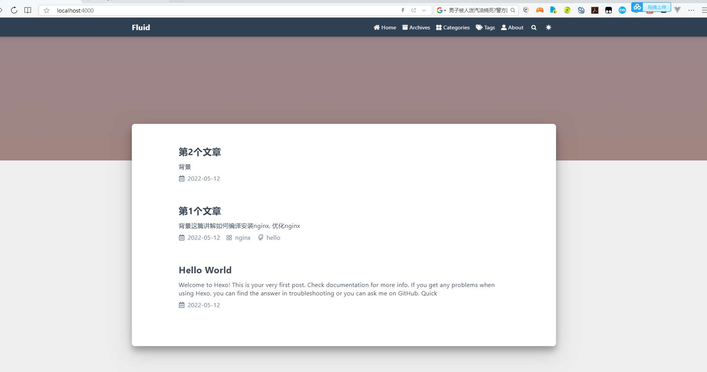


配置主题 `fluid` 需要准备一个文件 `_config.主题名.yml`

```
cp themes/fluid/_config.yml _config.fluid.yml
```

测试配置是否生效,修改 `_config.fluid.yml`

```yaml
  # 首页副标题的独立设置
  # Independent config of home page subtitle
  slogan:
    enable: true

    # 为空则按 hexo config.subtitle 显示
    # If empty, text based on `subtitle` in hexo config
    text: "Hello 05-12 .... "
```

重启 `npx hexo server`

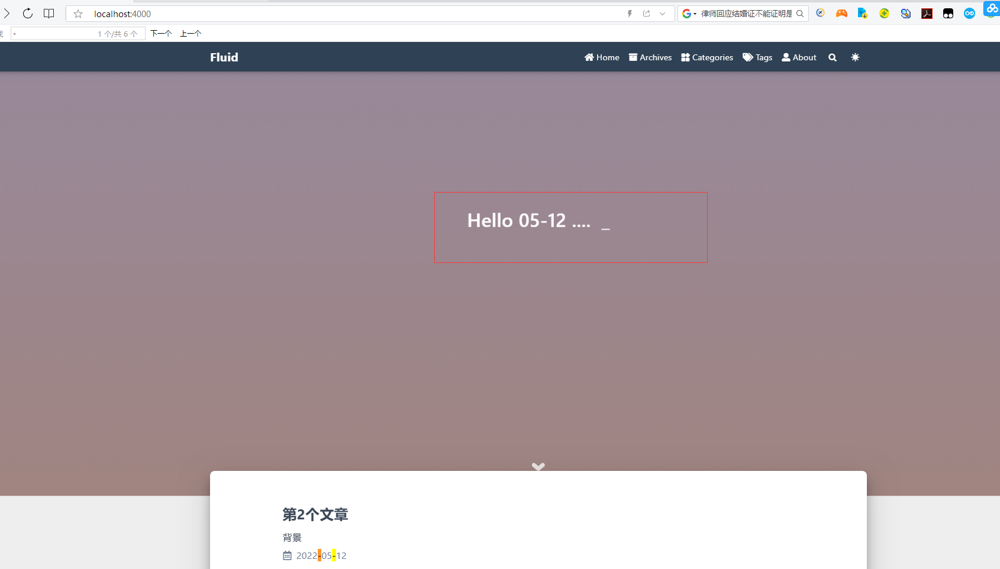


## 发布

准备脚本 `push.sh`

```
#!/bin/bash
git config --local pull.rebase true
git add .
git commit -m "笔记本-`date +%F_%T`"


git push origin main

git pull origin main
[ $? -ne 0 ] && exit -1

git push origin main

# test
start $(readlink -f .)/source/_posts
```

https://slcnx.github.io/

